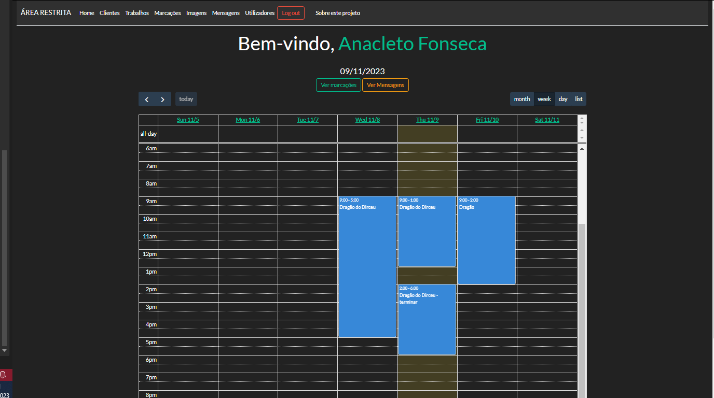

# Projeto InkWorks

Website com backoffice para gestão de pequeno negócio
  - fichas de clientes
  - ordens de trabalhos
  - marcação de sessões
  - anexação de imagens
  - gestão de mensagens
  - gestão de utilizadores

## Conteúdo

- [Como Utilizar](#como-utilizar)
- [Funcionalidades](#funcionalidades)

## Como Utilizar

Para usar o projeto:

1. Abra a solução no Visual Studio.
2. Carregue o ficheiro InkWorks.bacpac no SSMS para carregar a base de dados.
3. Execute o servidor local.

Também pode aceder a uma versão online [aqui](https://inkworks.somee.com/).

Utilize as seguintes credenciais para fazer login no backOffice do site como administrador:
- Email: anacleto@email.com
- Palavra-passe: anacleto

## Funcionalidades

Descrição das funcionalidades do sistema:

### Área Pública:

- Navegar e ver informações da empresa.
- Visualizar o portfólio (carregado no backOffice).
- Enviar mensagens à empresa (recebidas no backOffice).
- Fazer login na Área restrita.

### Área Restrita (BackOffice):

#### Página Inicial:

- Ver mensagem de boas-vindas.
- Botões de direcionamento rápido.
- Calendário que mostra as sessões agendadas.

#### Clientes:

- Ver lista de clientes.
- Criar novo cliente.
- Criar trabalho associado a cada cliente.
- Editar informações dos clientes.
- Remover clientes.
- Detalhes: Ficha de cliente.
- Ver/Editar/Remover dados deste cliente.
- Criar trabalho associado a este cliente.
- Histórico de trabalhos realizados pelo cliente.
- Histórico de mensagens associadas a este cliente.

#### Trabalhos:

- Ver lista de trabalhos.
- Criar sessão associada a cada trabalho.
- Editar informações dos trabalhos.
- Remover trabalhos.
- Detalhes: Dados do trabalho.
- Ver/Editar/Remover informações deste trabalho.
- Criar sessão associada a este trabalho específico.
- Anexar novas imagens a este trabalho.
- Lista de imagens anexadas a este trabalho.
- Histórico de mensagens associadas a este cliente.

#### Marcações (Sessões agendadas):

- Ver lista de sessões marcadas.
- Alterar ou remover sessões agendadas.
- As alterações aparecem no calendário da página inicial.

#### Imagens:

- Adicionar imagens a:
- Trabalhos.
- Galeria/Portfólio da Área Pública.
- Imagens não associadas a nada em específico (imagens de referência, etc.).
- Lista de imagens carregadas na galeria - Editar/Remover.
- Lista de imagens anexadas a trabalhos - Editar/Remover.

#### Mensagens:

- Lista de mensagens recebidas (enviadas a partir do formulário de contacto da Área Pública).
- Remover cada mensagem.
- Ver detalhes da mensagem.
- Ver dados do utilizador que enviou a mensagem.
- Criar ficha de cliente a partir de uma mensagem recebida.
- Associar a um cliente existente.

#### Utilizadores:

- Lista de utilizadores cadastrados no backOffice.
- Cada utilizador pode ser criado com uma autorização:
 - Padrão (acesso a todas as funcionalidades da Área Restrita).
 - Admin (acesso a todas as áreas + área de gestão de utilizadores).
- Criar novos utilizadores.
- Editar ou remover utilizadores existentes.

#### Sobre:

- Instruções.

